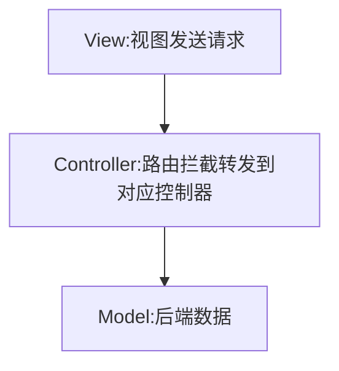
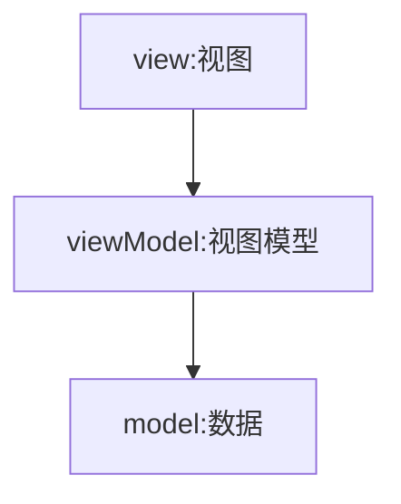

[TOC]

## mvc和mvvm

### mvc

```js
view(视图层)  
controller(路由，控制器)
model(后端给的JSON数据或死数据)

用户通过视图向后端发送请求，通过路由拦截，转发到对应的控制器的处理，获取到后端数据，最终渲染到页面
```



### mvvm

```js
Model(数据)
View(视图)
ViewModel(视图数据)


Vue就是一个典型的 mvvm 。
直接把数据挂载在vue实例中，通过vue可直接将数据渲染视图
视图发生改变，vue也会监听到视图的变化，在将视图中的数据写回数据层，
数据发生改变时，vue也会监听到数据变化，在将数据同步到视图。
称为数据的双向绑定。
```




## 监听响应式数据

### 监听对象变化

> 核心:Object.defineProperty

```js
1.vue初始化时会拿到当前data中的数据，调用 initData(vm) 方法初始化数据。 
2.在initData中调用 Observer(val) 方法，判断如果数据没有被观测过的话就是用 new Observer(value) 观测数据,观测的一种是数组，一种是对象。
3.如果是对象型非数组的话调用 this.walk(value) 方法，会把当前传入的对象进行循环调用 defineReactive(obj,key[i]),定义响应式变化 
4.使用 Object.defineProperty 重新定义数据,如果当前对象的至还是一个对象的话，回到第2步进行递归。
5.取值时调用 Object.defineProperty 的 get() 方法收集依赖,watcher。
6.如果数据改变时会通知watcher去更新数据,调用set() ,如果当前值和数据的值不一样的话调用 dep.notify() 通知视图更新。


	
** 基础类型的数据是不会进行观测，只监测data对象
```

### 监听数组的变化

> Object.defineProperty是监听不到数组的变化的，而是使用函数劫持，对数组常用的7个原生可改变数组的方法进行了改写，只要数组一改变就通知观测者

```js
vue将data中的数组，进行了原型链重写，指向了自己定义的数组原型方法，这样当调用数组API时，可以通知依赖更新，如果数组内包含引用类型，会对数组中的引用类型再次进行监控。

1.vue初始化时会拿到当前data中的数据，调用 initData(vm) 方法初始化数据。 
2.在initData中调用 Observer(val) 方法，判断如果数据没有被观测过的话就是用 new Observer(value) 观测数据,再判断如果有__ob__且类型是observer的话说明已经被监听了直接返回数据，观测的一种是数组，一种是对象。
3.如果为数组，让就让它的原型链指向 arrayMethods ，来改写数组方法。
4.只要调用了数组方法，就会执行一个函数，执行原来的方法并通知视图更新，ob.dep.notify()
5.如果使用了数组新增方法,push,unshift,splice的话，调用ob.observeArray(新增的数据)遍历数组的每个对象进行深度观测，所以只有数组里的对象才能进行响应式的数据变化。
```

## 为何采用异步渲染

> vue是组件级更新，当组件数据变就会更新 ,如果不采用异步更新，那么组件内的数据每次更新都会对当前组件进行重新渲染， 所以为了性能考虑，vue在本轮数据更新后，再去异步更新视图

```js
1.当数据变化后，调用dep.notify()方法,通知watcher进行更新
2.watcher会调用 update() 方法，调用时并不会立即更新，而是调用 queueWatcher方法 判断watcher的id（uid）去重后放入 queue队列 中。
3.最后在调用 nextTick(flushScheduierQueue) 异步刷新 queue队列,执行watcher,update钩子函数

**可以说是 渲染节流
```


## nextTick实现原理

> 经常会使用nextTick 保证当前视图渲染完成

```js
1.多次调用nextTick时只执行一次 timerFunc() ,因为执行完一次后pending就变为true了
2.timeFunc()是一个异步方法 
```
