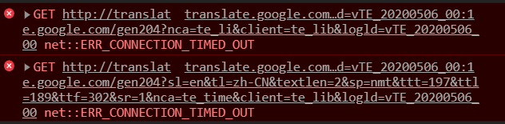
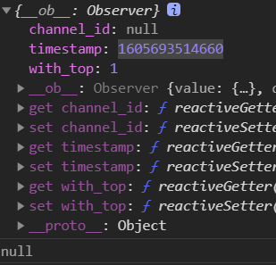
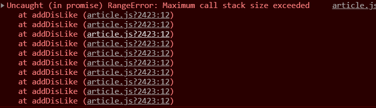

## 搭建项目

```js
1.vue create name

2.Vuex,Router,
    版本2.x
```


## vant

```js
1.安装
cnpm install vant

2.引入vant的所有组件
import Vue from 'vue';
import Vant from 'vant';
import 'vant/lib/index.css';

Vue.use(Vant);

```


## 适配库

### postcss-pxtorem

```js
将css里的px转为rem


1.安装
  cnpm install postcss-pxtorem -D

2.创建一个配置文件
  postcss.config.js

3.配置
module.exports = {
  plugins: {
    'autoprefixer': {
      browsers: ['Android >= 4.0', 'iOS >= 7']
    },
    'postcss-pxtorem': {
      rootValue: 37.5,//结果为：设计稿元素尺寸/32(一般750px的设计稿的根元素大小设置32)，比如元素宽320px,最终页面会换算成 10rem
      propList: ['*'], //属性的选择器，*表示通用
      selectorBlackList:[]    忽略的选择器   .ig-  表示 .ig- 开头的都不会转换
    }
  }
}
```

### flexible

```js
1.安装
npm install amfe-flexible

2.引入
import 'amfe-flexible'
```

## 二次封装axios库

```js
# 怎么处理同时传入 params 和 data 传参的形式。

1.utils/axios.js
  使用 axios.create 创建2个 instance 封装2个基地址,
  使用 .interceptors.request.use 添加请求头携带 token  
  
2.utils/fetch.js
  引入 axios.js 
  封装 fetchData 方法做 get 和 post 的请求处理，如果是 get 就是 params 属性传参，并做数据序列化处理，否则用 data 属性传参
  使用 try/catch 判断接口是否调用成功，成功将数据返回，失败返回 null。

3.utils/request.js
  引入 fetch.js
  调用 fetchData(路径，参数)
```


## login

+ __步骤__
  1. 使用 vant 布局页面,调整样式。
  
  2. 使用 import 动态导入路由。
  
  3. 调用接口，配置校验规则，设置登陆时的提示信息。
  
  4. 二次封装 axios，配置其全局路径，和 header 携带 token 。
  
  5. 登录成功后，通过 Vuex 封装 token ，存入用户信息，并对 token 做持久化。
  
     

## layout

+ **步骤**
  1. 布局导航栏，logo和搜索，配置页尾的4个二级路由。
  2. 定制每个功能模块的工作进度计划表。

### 主页

+ **步骤**
  1. 使用 __vant-tabs组件__ 搭建频道列表。
  2. 调用接口，有两个参数时间戳和id，渲染到频道列表，标题使用__vant-ell__,内容使用插槽 __slot="label"__ 插入图片和文字。
  3. 引入一段 css样式调试频道内容固定高度，从而出现滚动条。
  4. 实现 下拉刷新重新发送请求，把数据添加到数组头部，上拉加载更多。
  5. 将文章内容抽离为组件。
  6. 使用 dayjs 处理日期时间。
  7. 封装更多操作组件，使用 van-popup 。
  8. 如果用户登录则每个文章详情底下都有x按钮。
  9. 点击x时将id传给父组件，并处理大数问题。
  10. 点不感兴趣，调用接口删除文章。
  11. 点举报，调用举报接口。
  12. 右侧设置频道管理面包按钮，完成基本布局。
  13. 将用户频道渲染到用户我的频道，可选频道渲染 全部频道减去我的频道。
  14. 使用子传父，实现我的频道点击高亮。
  15. 在用户频道中点击频道添加到用户频道。
  16. 点击编辑，我的频道上有小×，点击x实现删除功能。
  
+ 难点

  频道管理的那一块，怎么实现 可选频道 和 我的频道的 选中和删除。

+ 注意

  ```
  vant-tabs 有懒加载效果，点击时才会渲染对应内容
  ```


## new知识

+ Vuex中的getters

  相当于vue实例中的计算属性

+ props中的属性

  默认值，校验

+ $router.back()

  返回的意思

## 问题

1. 为什么发送请求时发送2个请求

   ```js
   其中一个methods：OPTIONS 对跨域复杂的请求，进行请求预检，测试是否成功
   
   methods:get/post 才是真正发送的请求。
   ```

2. 报错

   

   + **解决**

     将浏览器的谷歌翻译禁用就可。

3. this.form 明明有值，为什么 this.orm.timestamp 就为null.

   

4. 刷新时列表重复渲染了两次

   + **解决**

     因为在钩子函数中调用了

5. 喜欢和取消喜欢，报错

   